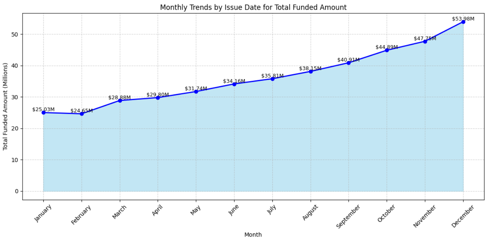

# 📊 Bank Loan Analysis

## 📌 Overview
This project analyzes loan application data to evaluate **funding trends, repayment performance, and customer demographics**.  
It includes **key performance indicators (KPIs)** and **visualizations** that highlight monthly, regional, and categorical insights into bank loan performance.  

---

## 🛠️ Steps in the Notebook
1. **Import Libraries**  
2. **Load Dataset**  
3. **Metadata of Data**  
4. **Key KPIs and Metrics**  
5. **Visualizations & Dashboards**  

---

## 📈 Key Performance Indicators (KPIs)
- **Total Loan Applications**  
- **MTD (Month-to-Date) Total Loan Applications**  
- **Total Funded Amount**  
- **MTD Total Funded Amount**  
- **Total Amount Received**  
- **MTD Total Amount Received**  
- **Average Interest Rate**  
- **Average Debt-to-Income Ratio (DTI)** 

### ✅ Good Loan Analysis  
- Good Loan Application Percentage  
- Good Loan Applications Count  
- Good Loan Funded Amount  
- Good Loan Total Received Amount  

### ❌ Bad Loan Analysis  
- Bad Loan Application Percentage  
- Bad Loan Applications Count  
- Bad Loan Funded Amount  
- Bad Loan Total Received Amount  

---

## 📊 Visualizations  

### 1. Monthly Trends  
- Funded Amount  
- Amount Received  
- Loan Applications  

  

 

 

---

### 2. Regional Analysis  
- Total Funded Amount by State  

  

---

### 3. Loan Term Analysis  
- Total Funded Amount by Loan Term  

  

---

### 4. Home Ownership Analysis  
- Total Funded Amount by Home Ownership Type  

  

---

## 🛠️ Tech Stack  
- **Python** (Pandas, NumPy, Matplotlib, Seaborn, Plotly)  
- **Jupyter Notebook / IDE of choice**  

---

